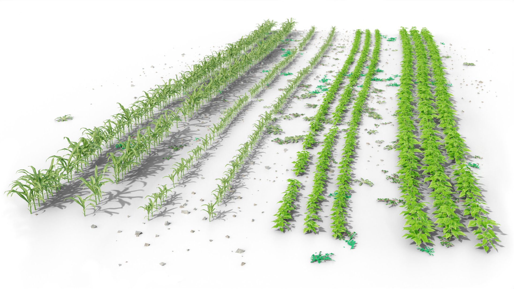

# CropCraft

CropCraft is a python script that generates 3D models of crop fields, specialized in
real-time simulation of robotics applications.



* Designed for real-time simulation
* Suitable for use with LiDARs and cameras
* Highly configurable (YAML file)
* Provide ground truth data (identify plant types in LiDAR data)


## Requirements

This program uses blender as a backend.
It is a 3D modeling software that you can dowload from the
[official website](https://www.blender.org/download/).
If you use Ubuntu, you can install it using snap:
```
snap install blender --classic
```
The minimal required version is `4.0`.
Ensure that blender is launchable from the command line.
It means that blender must be accessible using the `PATH` environment variable.

You also need to install some python requirements:
```
pip install -r requirements.txt
```

## Running

To generate a crop field, you first need to create a configuration file (YAML formats).
Some examples are available in the [`examples`](/examples) directory.
Then you can execute the `cropcraft.py` script and specify the path of the chosen configuration
file.
```
python cropcraft.py examples/test1.yaml
```
This command will generate a blender file named `test1.blend` and a gazebo model named `test1`

Some options are available and described using
```
python cropcraft.py --help
```

## Documentation

* [Description of the configuration file format](doc/configuration_format.md)
* [How to add your own assets](doc/add_assets.md)
